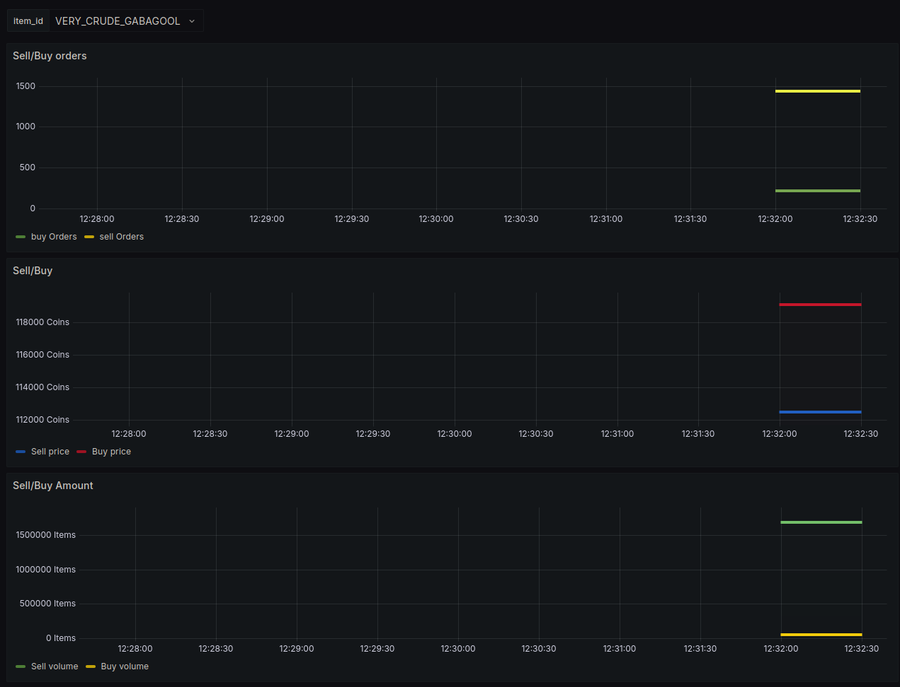

# Skyblock Prices Exporter

## Overview
This is a Prometheus exporter for Hypixel Skyblock Bazaar prices. It fetches item prices from the Hypixel API and exposes them as Prometheus metrics, which can then be used to create a Grafana dashboard.

## Features
- Fetches Skyblock Bazaar item prices from the Hypixel API.
- Exposes item prices and statistics as Prometheus metrics.
- Easy integration with Grafana for visualization.

## Installation

### Prerequisites
- Python 3.7+

### Install Dependencies
```sh
pip install requests aiohttp 
```

## Usage

Run the exporter with:
```sh
python main.py
```
By default, the exporter runs on port `9015` and exposes metrics at `/metrics`.

## Metrics Format
The exporter provides metrics in the following format:
```text
skyblock_item{item_id="ENCHANTED_DIAMOND", type="sellPrice"} 1234.56
skyblock_item{item_id="ENCHANTED_DIAMOND", type="buyPrice"} 1200.78
```
Where:
- `item_id` is the Skyblock item ID.
- `type` can be `sellPrice`, `sellVolume`, `sellOrders`, `sellMovingWeek`, `buyPrice`, `buyVolume`, `buyOrders`, or `buyMovingWeek`.

## Configuration
The exporter runs on port `9015` by default. To change this, modify the `webserver(port=9015, data=items)` line in `main.py`.

## Prometheus Configuration
Add the following scrape job to your Prometheus configuration:
```yaml
scrape_configs:
  - job_name: 'skyblock_prices'
    static_configs:
      - targets: ['localhost:9015']
```

## Grafana Dashboard
You can visualize the collected data in Grafana by creating a new dashboard and using PromQL queries such as:
```text
skyblock_item{item_id="ENCHANTED_DIAMOND", type="sellPrice"}
```

## License
This project is licensed under the MIT License.


